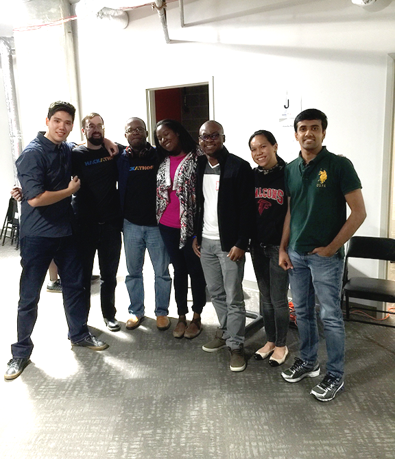

#marta-hackathon_V2

Central Repo for the MARTA-Mobility project **updated March 11th, 2017

##Synopsis
This project's aim is to implement MARTA's existing schedule data into simple interfaces for the convenience of Marta-Mobility customers.
<!-- 
##Code Example
Show what the library does as concisely as possible, developers should be able to figure out how your project solves their problem by looking at the code example. Make sure the API you are showing off is obvious, and that your code is short and concise. -->

##Motivation
To improve the lives of Atlanta's disabled by making transit simpler and more predictable.

<!-- ##Installation
Provide code examples and explanations of how to get the project. -->

<!-- ##API Reference
Depending on the size of the project, if it is small and simple enough the reference docs can be added to the README. For medium size to larger projects it is important to at least provide a link to where the API reference docs live. -->

<!-- ##Tests
Describe and show how to run the tests with code examples. -->

##Contributors
	Danny, Mark, Nerando, Brittany, Anne, Darshan, and more.

##License
<!-- 	MIT License

Copyright (c) [2017] [Marta-Mob]

Permission is hereby granted, free of charge, to any person obtaining a copy
of this software and associated documentation files (the "Software"), to deal
in the Software without restriction, including without limitation the rights
to use, copy, modify, merge, publish, distribute, sublicense, and/or sell
copies of the Software, and to permit persons to whom the Software is
furnished to do so, subject to the following conditions:

The above copyright notice and this permission notice shall be included in all
copies or substantial portions of the Software.

THE SOFTWARE IS PROVIDED "AS IS", WITHOUT WARRANTY OF ANY KIND, EXPRESS OR
IMPLIED, INCLUDING BUT NOT LIMITED TO THE WARRANTIES OF MERCHANTABILITY,
FITNESS FOR A PARTICULAR PURPOSE AND NONINFRINGEMENT. IN NO EVENT SHALL THE
AUTHORS OR COPYRIGHT HOLDERS BE LIABLE FOR ANY CLAIM, DAMAGES OR OTHER
LIABILITY, WHETHER IN AN ACTION OF CONTRACT, TORT OR OTHERWISE, ARISING FROM,
OUT OF OR IN CONNECTION WITH THE SOFTWARE OR THE USE OR OTHER DEALINGS IN THE
SOFTWARE. -->
